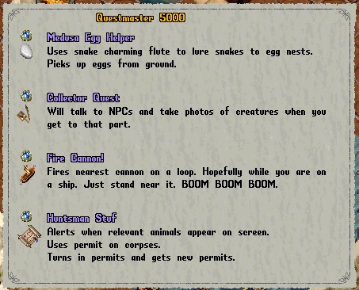
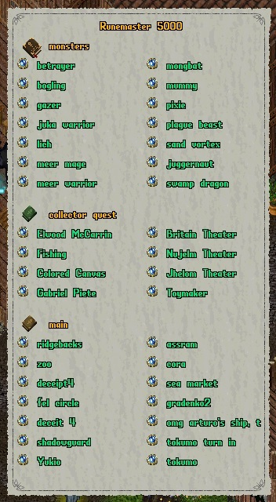

# Ultima Online Razor Enhanced Script Library

These are scripts I've either written, liberally modified, or just stored for safekeeping (these are the good ones written by others). They have been tested on a few free shards:

* UOAlive
* InsaneUO

They may or may not work on others. Requires razor enhanced 0.8.2.242

## Setup

> [!TIP]
> **NEW!** Go to the [scripts](https://github.com/GloriousRedLeader/omgarturo/tree/master/scripts) folder for standalone scripts. You will find all of the scripts there.
> Note that this is experimental and I hope that it works. You can always use the traditional method that has all the scary setup steps below.

### New Setup

This is the new easy, way. Just download what you need from here: [scripts](https://github.com/GloriousRedLeader/omgarturo/tree/master/scripts). These are all now 100% stanadlone scripts.

### Traditional Setup (deprecated)

> [!WARNING]
> Don't use this any more. 

Kind of a pain. Start by cloning this repo into your scripts directory.

```bash
cd <razor_install_dir>/Scripts
git clone https://github.com/GloriousRedLeader/omgarturo.git
```

That will create the **omgarturo** folder in your /Scripts folder and download all files from this repo into it. If you don't have git or don't care for it, you'll still need to create the directory structure *exactly* as it is below. All files in **omgarturo/src/fm_core** are required. The rest of the files you can just pick and choose what you want.

Also, if this file doesn't exist, create it: /Scripts/\_\_init\_\_.py. This is in the root /Scripts folder. It is an empty file. It just needs to be present. You might already have it.

```bash
/<razor_install_dir>/Scripts/omgarturo # This repo
├── inline_imports_v2.py          # Inliner tool (stays in root)
├── src/                          # Source files
│   ├── fm_core/                  # Source Core modules  
│   │   ├── core_items.py
│   │   ├── core_crafting.py
│   │   ├── __init__.py           # 100% needed
│   │   └── ... (11 core modules)
│   ├── BODBuilder.py             # All Python Source scripts
│   ├── TrainNecro.py
│   ├── Lootmaster-1-8-0.cs       # All C# scripts
│   ├── __init__.py               # 100% needed
│   └── ... (110 Python + 6 C# files)
└── scripts/                      # Generated standalone scripts (use these)
    ├── BODBuilder.py             # Inlined, standalone versions
    └── ... (98 generated files)

```

* *omgarturo/src* -> The scripts directly in this folder are what you'll use. Modify these. Configure them. Bind them to keys. Covers training skills and powerful loops for gathering, attacking, crafting, etc.
* *omgarturo/src/fm_core* -> This is framework stuff I've written. All the main business logic resides here. No need to touch unless you're insane.

**Note**: You do NOT need to add the scripts in **fm_core** into Razor Enhanced. They just need to be present in the directory structure outlined above. You can use the command "git pull" inside the **omgarturo** folder to get the latest changes. 

## Usage

Useful things you'll find:

Several combat scripts that are configurable for many uses. They are all based off two main archetypes: caster and dexer. It is recommended to customize these to meet your needs. You'd want to set some healing targets in the caster script if you want to heal your pet for example. 
Here are some pre-canned versions that are ready for your customization!
|Script|Single Target|AoE|Heals|Cures|Bard|Pets|Other|
|------|-------------|---|-----|-----|----|----|-----|
|[Basic Chiv Dexer](https://github.com/GloriousRedLeader/omgarturo/blob/master/scripts/BasicChivDexerLoop.py)|Primary Weapon Ability|None|None|None|None|None|Consecrate Weapon|
|[Shield Basher Primary Ability](https://github.com/GloriousRedLeader/omgarturo/blob/master/scripts/BasherPrimaryLoop.py)|Shield Bash + Armor Ignore|None|Bandages|Remove Curse; Bandages|None|None|Consecreate Weapon|
|[Shield Basher Secondary Ability](https://github.com/GloriousRedLeader/omgarturo/blob/master/scripts/BasherSecondaryLoop.py)|Shield Bash + Armor Ignore|None|Bandages|Remove Curse; Bandages|None|None|Consecreate Weapon|
|[Pure Necro - Conduit](https://github.com/GloriousRedLeader/omgarturo/blob/master/scripts/PureNecroConduitLoop.py)|Poison Strike + Pain Spike + Evil Omen + Strangle + Corpse Skin|Conduit|Spirit Speak|None|None|Summon Familiar + Animated Dead|Cloak of Grave Mists; Vampiric Embrace|
|[Pure Necro - Conduit (No Pet)](https://github.com/GloriousRedLeader/omgarturo/blob/master/scripts/PureNecroConduitNoPetLoop.py)|Poison Strike + Pain Spike + Evil Omen + Strangle + Corpse Skin|Conduit|Spirit Speak|None|None|None|Cloak of Grave Mists; Vampiric Embrace|
|[Pure Necro - Wither](https://github.com/GloriousRedLeader/omgarturo/blob/master/scripts/PureNecroWitherLoop.py)|Poison Strike|Wither|Spirit Speak|None|None|Summon Familiar + Animate Dead|Cloak of Grave Mists; Vampiric Embrace|
|[Pure Necro - Wither (No Pet)](https://github.com/GloriousRedLeader/omgarturo/blob/master/scripts/PureNecroWitherLoop.py)|Poison Strike|Wither|Spirit Speak|None|None|None|Cloak of Grave Mists; Vampiric Embrace|
|[Mage Bard Thunderstorm](https://github.com/GloriousRedLeader/omgarturo/blob/master/scripts/MageBardThunderstormLoop.py) |Word of Death|Thunderstorm + Wildfire|Greater Heal + Gift of Renewal|Arch Cure|Inspire + Invigorate + Discord|None|Gift of Life; Protection; Attune Weapon|
|[Mage Bard Wildfire](https://github.com/GloriousRedLeader/omgarturo/blob/master/scripts/MageBardWildfireLoop.py) |Word of Death|Wildfire|Greater Heal + Gift of Renewal|Arch Cure|Inspire + Invigorate + Discord|None|Gift of Life; Protection; Attune Weapon|
|[Mage Bard Heals](https://github.com/GloriousRedLeader/omgarturo/blob/master/scripts/MageHealLoop.py) |None|None|Greater Heal + Gift of Renewal|Arch Cure|Inspire + Invigorate + Discord|None|Gift of Life; Protection; Attune Weapon|

A couple of resource gathering scripts. Use with caution. Don't break any rules. Includes [fishing on a boat](https://github.com/GloriousRedLeader/omgarturo/blob/master/scripts/FishLoopBoat.py), [crab fishing](https://github.com/GloriousRedLeader/omgarturo/blob/master/scripts/FishLoopCrab.py), [lumberjacking](https://github.com/GloriousRedLeader/omgarturo/blob/master/scripts/LumberjackingLoop.py), and [mining](https://github.com/GloriousRedLeader/omgarturo/blob/master/scripts/MiningLoop.py).

[Restocker](https://github.com/GloriousRedLeader/omgarturo/blob/master/scripts/Restocker.py) is InsaneUO specific. It moves items from resource boxes (miner's storage box, reagent box, etc.) to a real container. No more clicking a million times and letting resources pile up at your feet. Useful in conjunction with bod builder. 

There are some quality of life scripts for simple things like [mounting](https://github.com/GloriousRedLeader/omgarturo/blob/master/scripts/PetMount.py) and [dismounting](https://github.com/GloriousRedLeader/omgarturo/blob/master/scripts/PetDismount.py) pets, [leashing](https://github.com/GloriousRedLeader/omgarturo/blob/master/scripts/LeashPets.py) pets, etc.

[BOD Builder](https://github.com/GloriousRedLeader/omgarturo/blob/master/scripts/BODBuilder.py) script to automate crafting and filling small and large bods. Seriously, this does 100% of the work for you. Highly configurable. Current support for
* Alchemy
* Tailoring
* Inscription
* Blacksmithy
* Tinkering

A [CraftItems](https://github.com/GloriousRedLeader/omgarturo/blob/master/scripts/CraftItems.py) script. This might seem silly but I find it invaluable for min/maxing suits. This will craft a particular item (specified in script) repeatedly and discard any items that don't pass your filter requirements (also configured in script). For example, if you are an advanced crafter looking for a specific set of resists on leather leggings, e.g. 3 physical, 10 fire, 11 cold - then this script is for you. It will discard all the rubbish. Reforging is a painful process, and this helps make it easier by providing a large pool of potential items. But really, even if  you aren't reforging and just imbuing, it is still helpful. Makes life easier.

**Move Items** scripts to put things in various containers. Lots of different flavors and uses. They all present with a target reticle so no need for hard coding anything. Different flavors include:
* [Move number of items](https://github.com/GloriousRedLeader/omgarturo/blob/master/scripts/MoveNumberOfItems.py) from one container to another (type number of items in chat, target source container, target destination container)
* [Move all items by type](https://github.com/GloriousRedLeader/omgarturo/blob/master/scripts/MoveItemsByID.py) from their current container to another container (target item, target destination container)
* [Move all items by type and color](https://github.com/GloriousRedLeader/omgarturo/blob/master/scripts/MoveItemsByIDAndColor.py) from their current container to another container, you can use this turn in bods (target item, target destination container)
* [Move all items](https://github.com/GloriousRedLeader/omgarturo/blob/master/scripts/MoveAllItemsFromContainer.py) from one container to another container (target source container, target destination container)

[Automated character movement](https://github.com/GloriousRedLeader/omgarturo/blob/master/scripts/RailLoop.py) script that uses the rails framework. Several default routes already established. You can easily add your own, it's just a list of x, y coordinates. Use this in conjunction with dexer / caster loops for maximum farming. For the love of all that is holy, use while you're at your machine supervising. You will get banned.

A script that [scans journal entries and alerts](https://github.com/GloriousRedLeader/omgarturo/blob/master/scripts/JournalAlert.py) with obnoxious sounds and overhead text. Useful for holiday bosses so you don't miss the message. Also good for hunting down specific NPCs like when doing the honesty virtue.

The [QuestHelper](https://github.com/GloriousRedLeader/omgarturo/blob/master/scripts/QuestHelper.py) script has misc. utility functionality. Currently:
- Medusa Egg Farmer - Enable to use your flute to lure snakes to nest. Auto picks up eggs from ground.
- Collector Quest - Talks to NPCs. Takes pictures of mobs. Use a runebook with the RuneMaster (below) for maximum speed.



Some convenient **Travel** scripts to help you zip around. There is a series like [RecallOrSacredJourneyRune1](https://github.com/GloriousRedLeader/omgarturo/blob/master/scripts/RecallOrSacredJourneyRune1.py) which will open up a runebook (first come first serve) and go to the *first* rune. The number after the file name tells the script which rune to use. I usually bind the first 10 runes to shift + num. Makes life easy especially when doing things like the collector quest. 

Also in the fast travel category is the [RuneMaster5000](https://github.com/GloriousRedLeader/omgarturo/blob/master/scripts/RuneMaster.py) which creates a gump with all runes from atlases and runebooks. There is no limit on this, the gump will keep expanding to accommodate all runebooks and atlases it finds in your backpack. **Note:** Dorana has a RuneMaster which is far suprior, so, use his: [Dorana RuneMaster](https://github.com/dorana/RazorEnhancedScripts/blob/master/RazorScripts/RuneMaster.cs)

Here is what the RuneMaster5000 looks like:



[Shadowguard](https://github.com/GloriousRedLeader/omgarturo/blob/master/scripts/Shadowguard2.cs) script from Dorana. Just keeping a copy. This thing is amazing. Dear god.

[Lootmaster](https://github.com/GloriousRedLeader/omgarturo/blob/master/scripts/Lootmaster-1-8-0.cs) script from Dorana. Just keeping a copy for posterity.

A script that [opens Messages in a bottle and sorts them](https://github.com/GloriousRedLeader/omgarturo/blob/master/scripts/MIBSorter.py) into 3 chests, one for each section of the map (west, central, east). This makes fishing MiBs much more efficient since you aren't hunting all over the map, just 1/3 of it with more condensed spots. I usually take about 100 of them with me. The second part to this is a [script by foobarvar](https://github.com/GloriousRedLeader/omgarturo/blob/master/scripts/SOSCharter.cs) that will add the sos scrolls (also opens mibs) in your pack as coordinates on the map. This is truly amazing. You will of course need to manually remove the coordinates after you fish the location, but thats easy.

An [IDOC Scanner](https://github.com/GloriousRedLeader/omgarturo/blob/master/scripts/IDOCAlert.py) script. This thing is awesome. Written by someone else (can't track down author). Just storing for safe keeping. 

[Character Stats](https://github.com/GloriousRedLeader/omgarturo/blob/master/scripts/CharacterStats.py) is fairly worthless now. Just use [mystats in game. This WILL show you overcapped resists though which is nice. Note that it does get a little wonkie sometimes and you'll have to close and re-open your paperdoll. This script will tell you when it needs to be done (has something to do with item caching in the client / razor).

## Credits

I wrote some of this stuff. Others I am just storing for safekeeping. These were acquired via discord or github. All credit goes to original authors.

## Warning

There are some powerful features here. Use with care. Don't be a jackass.
